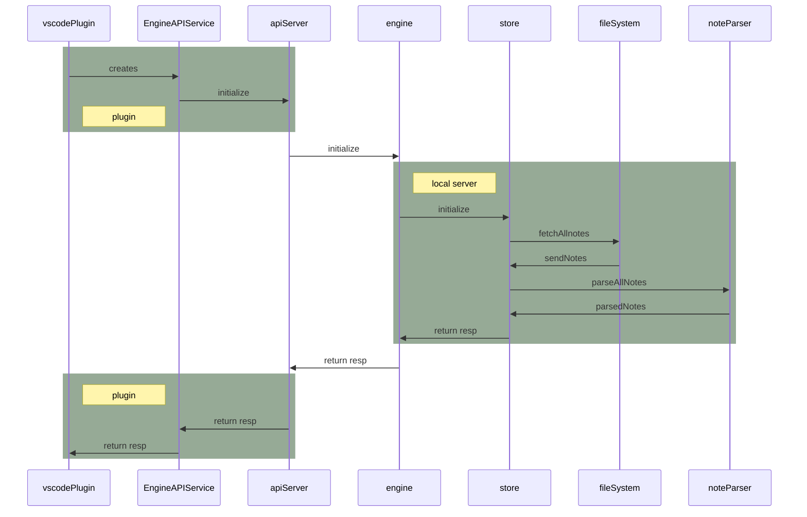

## Initialization

This goes into details of the startup sequence when Dendron first loads

## Trace

- src/extension.ts: activate {
    Logger.configure(context, "debug")
}
    - src/_extension:activate
        - ...
        - startServerProcess

## Details

These are some implementation details for further reading

See the [Video walkthrough](https://youtu.be/nWJCP1DR5Io) that goes through initialization in detail

It covers the following components:
- vscodePlugin
- EngineAPIService
  - created in [[../packages/plugin-core/src/_extension.ts#^9dr6chh7ah9v]]
  - implements DEngineClient interface for engine -> [[../packages/common-all/src/types/typesv2.ts#^sdxp5tjokad9]]
- apiServer
  - in production, we launch `apiServer` in a separate process, but if not, we run everything in same process. see [[../packages/plugin-core/src/_extension.ts#^pyiildtq4tdx]]
- engine
  - See [[Engine|dendron://dendron.docs/pkg.dendron-engine.t.engine.arch]] for additional details on engine initialization
- store
- fileSystem
- noteParser

## Resources:
* Entry Point: [[../packages/engine-server/src/enginev2.ts]]
- See [[Engine|dendron://dendron.docs/pkg.dendron-engine.t.engine.arch]] for additional details
