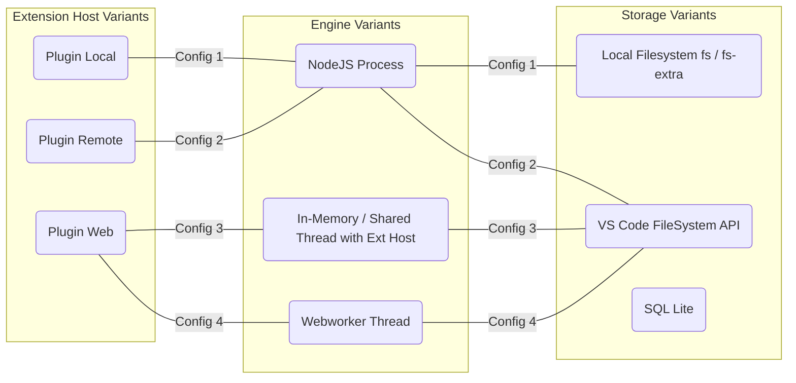

## Supporting Three Types of Extension Hosts

VS Code now can run in various environments and uses [different extension hosts](https://code.visualstudio.com/api/advanced-topics/extension-host) for each environment. In order to work everywhere, Dendron needs to be able to run in different configurations. 



### Notes

- Config 1 is what's being used by the local version of the Dendron plugin (running on local Extension Host)
- Config 3/4 is what we'll use to run the Web Extension flavor of Dendron (4 is the ideal state, but 3 is easier to implement) (Effort in progress as of August 2022)
- Only Plugin-Local (and CLI) have access to regular fs/ fs-extra API's.  Everything else will need to use the [VS Code FileSystem API](https://code.visualstudio.com/api/references/vscode-api#FileSystem)
- Node JS Engine provides the best performance, but can only be used in a Node JS environment. In Memory provides the worst performance, but is the simplest implementation. It currently is the environment we use for our test pass. Webworker thread provides better performance for the Plugin-Web variant than the In-Memory option.
- We can use a Dependency Injection framework to help us compose the right configuration for the given environment. We can detect the environment we're in during extension activate via [`ExtensionKind` API from VSCode](https://code.visualstudio.com/api/advanced-topics/remote-extensions#varying-behaviors-when-running-remotely-or-in-the-codespaces-browser-editor) 
- Prefer using `vscode-uri`'s `Utils` method over `path`. The `path-browserify` lib does not extends support for windows currently. See [Windows support · Issue #1 · browserify/path-browserify](https://github.com/browserify/path-browserify/issues/1)

```js
const txtPath = document.uri.fsPath;
const bad = path.basename(txtPath); //bad
const good = Utils.basename(txtPath); //good
```

https://code.visualstudio.com/api/extension-guides/web-extensions#update-existing-extensions-to-web-extensions