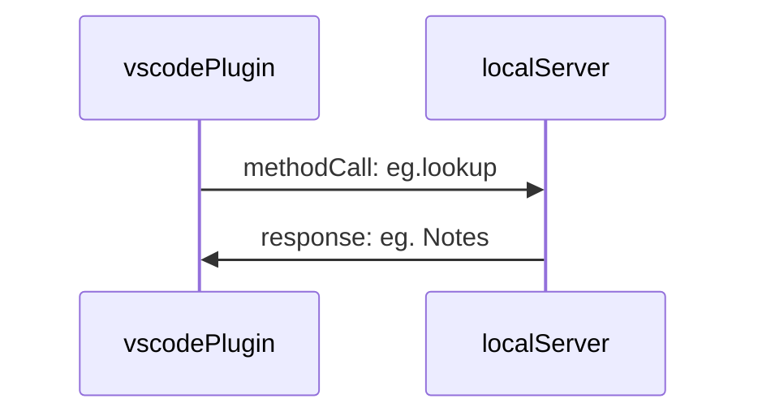

## Summary

Describes Dendron Plugin Architecture

## Design

- [[../packages/plugin-core/src/features/DefinitionProvider.ts]]
- [[../packages/plugin-core/src/features/DefinitionProvider.ts#^afvzmuby8ih9]]

The Dendron Plugin is designed with a client server architecture. The client in this case is the Code Plugin.  
The server is a local express.js server that starts in a separate process when the extension first activates.

The reason we went with this design:

- flexibility: this allows us to extend Dendron functionality with other clients (eg. different IDE's, vim, web extensions, native applications, etc)
  - NOTE: the [[pkg.dendron-cli]] is the only official client for the server at this time
- performance: we outsource computationaly expensive operations to the server running on a separate process which means that we don't block the main thread of the client during activation and regular usage

## Startup

![[dendron://dendron.docs/pkg.dendron-engine.lifecycle#initialization,1:#*]]
