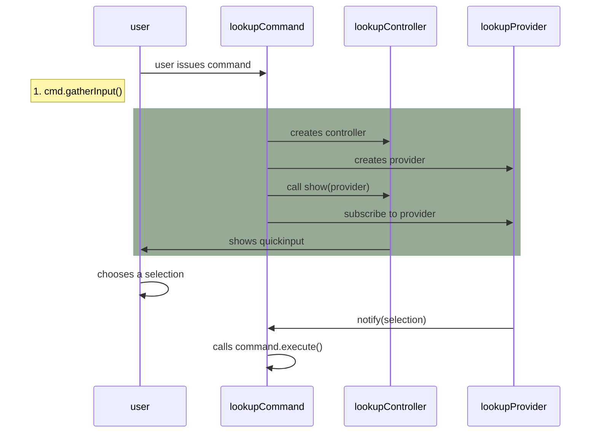

This goes over adding a new command with lookup. To see an example, see this [command](https://github.com/dendronhq/dendron/blob/master/packages/plugin-core/src/commands/InsertNoteLink.ts) and this commit: `cc8a02b4`.

## Lifecycle



The execution in pseudocode

![[dendron://dendron.docs/pkg.plugin-core.t.commands#initialization,1:#*]]

## Steps

### Decide on a name
1. Dendron commands follow a `VERB + NOUN` convention (eg. Go to Note) 

### Add new command

#### Add constant key
1. Add command to `DENDRON_COMMANDS` under `plugin-core/src/constants.ts`
   - NOTE: if you want to add a keyboard binding, see [[Keyboard Shortcut|dendron://dendron.docs/pkg.plugin-core.dev.cook.add-new-command#keyboard-shortcut]]
1. Update the plugin config
![[dendron://dendron.docs/pkg.plugin-core.dev.cook.update-plugin-config#steps,1]]

#### Create new command
1. Create the new command in `plugin-core/src/commands/{COMMAND_NAME}.ts`
   - you can copy the contents of an existing command (eg. `src/commands/ShowHelp.ts`) to help you get started
1. Write command logic
1. Add command to [[../packages/plugin-core/src/commands/index.ts]]
1. Test your command manually, see [[Manual Testing|dendron://dendron.docs/pkg.plugin-core.qa.test#manual-testing]]

Some other notes:

- If it makes sense, add a keyboard shortcut for the command. Make sure it doesn't conflict with an generic VSCode command or existing Dendron commands. You can detect existing keybindings by using the guide [here](https://code.visualstudio.com/docs/getstarted/keybindings#_detecting-keybinding-conflicts)
- If your command requires an active workspace to function, make sure that `requireActiveWorkspace = true`
  - eg: see [[../packages/plugin-core/src/commands/CreateDailyJournal.ts]]
  ```ts
  export class CreateDailyJournalCommand extends CreateNoteWithTraitCommand {
   // THIS needs to be set to tell Dendron to NOT activate this command unless dendron is active
   static requireActiveWorkspace: boolean = true;
   ...
  }
  ```
- If your command needs to manually clean up resources, make sure that any places where your command is constructed that it gets properly cleaned up when out of scope. An example of this is with the `NoteLookupCommand`. The preferred way to do this is by implementing the vscode `Disposable` interface (although `NoteLookupCommand` doesn't do this yet).
- If your command involves opening a note, also return it in the `CommandOutput` signature. this makes it easy to compose the command as well as test it

### Add Tests

1. Write tests

   - tests are in `plugin-core/src/test/suite-integ/{COMMAND}`
   - testing instructions are [[here|dev.process.qa]]

### Update package.json
![[dendron://dendron.docs/pkg.plugin-core.dev.cook.update-pkg-json]]

### Submit a pull request

1. Submit pull request. See process [[here|dendron://dendron.docs/dev.process.review.checklist.basics]]

### Gotchas

If the command needs to accept input objects from VSCode, for example [[ShowPreview|../packages/plugin-core/src/commands/ShowPreview.ts]], then base your command on [[InputArgCommand|../packages/plugin-core/src/commands/base.ts#L168]] and avoid adding `gatherInputs` and `enrichInputs`. Otherwise Dendron can convert the input object into a plain javascript object.

### Keyboard Shortcut

1. To add a keyboard binding to a command, add the `keybindings` property to the command.

```ts
keybindings: {
    key: "ctrl+shift+i",
    mac: "cmd+shift+i",
    // use the `when` clause to enable the command only when the dendron plugin is active
    // generally advisable for most commands
    when: DendronContext.PLUGIN_ACTIVE,
}
```

Example: https://github.com/dendronhq/dendron/blob/master/packages/plugin-core/src/constants.ts#L267:L267

### Input Validation

## Reference

- BaseClass for all commands: [[../packages/plugin-core/src/commands/base.ts]]
