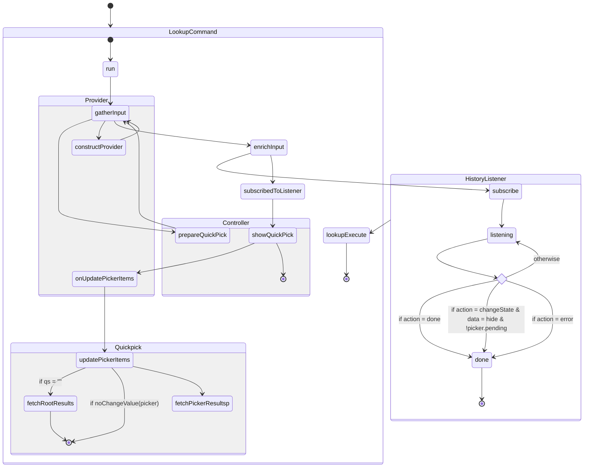

## Summary

This describes the logic for Note Lookup

## State Diagram

### State transitions for NoteLookupCommand



## Steps

- [[Gather Input|pkg.dendron-plugin.t.lookup.internal#gather-input]]
  - [[Prepare Quickpick|pkg.dendron-plugin.t.lookup.internal#prepare-quickpick]]
    - initialize all buttons
- enrichInput
  - show `QuickPick`
- showQuickPick
  - updatePickerItems
  - if `noConfirm`, don't show widget
    - update selected items to current current items
    - call `provider.onDidAccept`
  - else show the widget
    - wait until user accepts or cancels
- execute
  - open `picks`
  - [[OnAccept|pkg.dendron-plugin.t.lookup.internal#onaccept]]

## Code

### Gather Input

- this method is responsible for configuring and instantiating the lookup controller and provider

  - controller controls presentation of the quickinput
  - provider controls the data retrieval behavior
  - on success, will return the following [response type](https://github.com/dendronhq/dendron/blob/master/packages/plugin-core/src/components/lookup/LookupProviderV3.ts)
  - NOTE: because we can't simply block on `showQuickInput`, we return a promise that listens to a `lookupProvider` event with the corresponding `id` of the particular command

- src/commands/NoteLookupCommand.ts

```ts
gatherInputs {

    lc = this._controller = LookupControllerV3.create(buttons:[...], ...)
    provider = new NoteLookupProvider("lookup", {
        allowNewNote: true,
        ...
    })
    lc.prepareQuickPick
}
```

#### NoteLookup Provider

- [[onDidAccept|dendron://dendron.docs/pkg.plugin-core.ref.note-lookup-provider#ondidaccept]]

### Prepare Quickpick

- src/components/lookup/LookupControllerV3.ts

```ts
prepareQuickPick {
    quickpick.onTriggerButton = @onDidTriggerButton
    refreshButtons
}

showQuickPick {
    provider.onUpdatePickerItems

}
```

#### OnDidTriggerButton

```ts
onDidTriggerButton(btn) {
    find(btn, @state.buttons).pressed = btn.pressed
    refreshPickerBehavior(@state.buttons)
}
```

#### RefreshPickerBehavior

```ts
refreshPickerBehavior {
    buttonsEnabled :=
    buttonsDisabled :=

    buttonsEnabled.map bt => bt.onEnable
    buttonsDisabled.map bt => bt.onDisable
}
```

### OnUpdatePickerItems

- [[onUpdatePickerItems|dendron://dendron.docs/pkg.plugin-core.ref.note-lookup-provider#onupdatepickeritems]]

#### fetchpPickerResults

- [[../packages/plugin-core/src/components/lookup/NotePickerUtils.ts]]

```ts
resp = engine.queryNotes;
nodes = filterPickerResults;
```

### OnAccept

This gets triggered when the user selects a result form the quickpick.

Type Signature

```ts
quickpick: DendronQuickPick
selectedItems: NoteItemSelection[]
```

#### Pseudocode

- src/components/lookup/LookupProviderV3.ts

```ts
onDidAccept {
    selectedItems := picker

    selectedItems ??= fetchPickerResultsNoInput

    if hasNextPicker(picker)

    resp = @_onAcceptHooks.map { hooks
        hook(picker, selectedItems)
    }

    HistoryInstance.add {
        source: lookupProvider,
        action: done,
        id: @id,
        data: {
            selectedItems,
            onAcceptHookResp: resp
        }
    }

}
```

```ts
execute {
    @acceptItem
}

acceptItem(item, picker) {

    throw if not picker.validate(item)

    if isNew(item) {
        @acceptNewItem
    } else {
        @acceptExistingItem
    }
}

acceptExistingItem {
    uri := item
    show uri
}

acceptNewItem(item, picker) {
    fname := picker
    if isStub(item) {
        note = notes[item.stub]
        delete note.stub
    } else {
        vault := getVaultForNewNote
        note = Note.create item

        if picker.hasSelectionProcessFunc {
            picker.hasSelectionProcessFunc(note)
        }

        if matchSchema(note) {
            addSchema(note)
        }
        if note.schema.template {
            applyTemplate(note)
        }
    }
    note = picker.transformTitle(note)
    picker.onCreate(note)
    writeNote note
}

```

### getVaultForNewNote

- [[../packages/plugin-core/src/commands/NoteLookupCommand.ts#^8jd6vr4qcsol]]

```ts
getVaultForNewNote {

    vault := picker.vault || getVaultForOpenEditor

}
```

## Related

- [[Lookup|dendron://dendron.docs/pkg.dendron-engine.t.lookup]]
