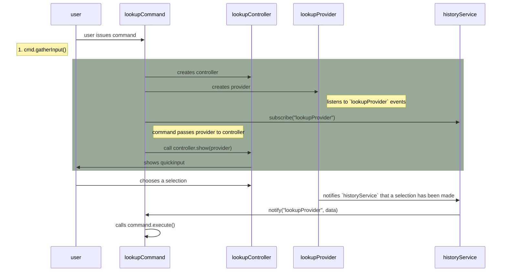

## Code

- [[../packages/plugin-core/src/commands/NoteLookupCommand.ts]]


```ts
/**
 * Executed after user accepts a quickpick item
 */
execute {
  selected := getSelected
  ...
  notesToShow :=

  notesToShow.map showNote(note)
}
```