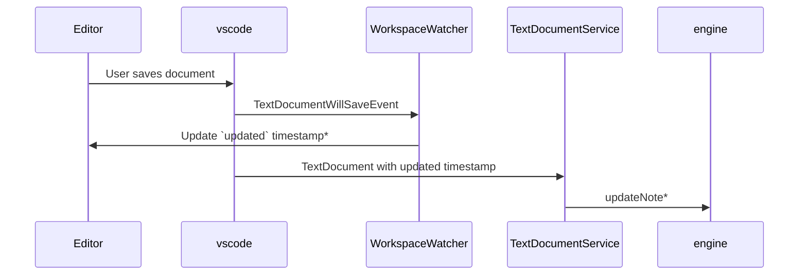
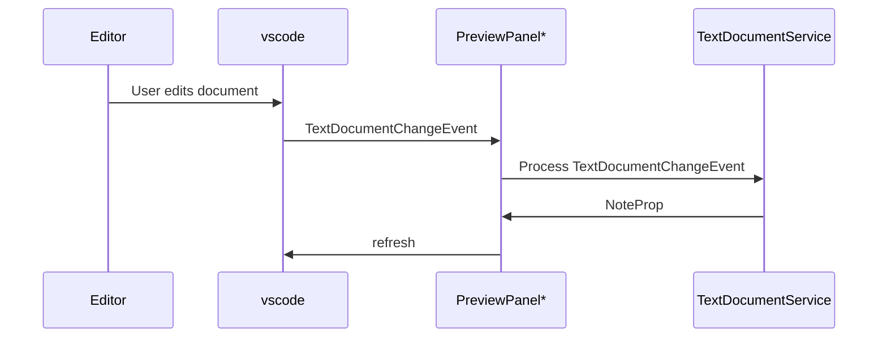

#stage.germ

## Lifecycle

- location: src/workspace.ts
```ts
activateWatchers {

    ... 
    fileWatcher = new FileWatcher(vaults)
    schemaWatcher = new SchemaWatcher(vaults)

}
```

## User actions
The following diagrams will showcase how actions in the workspace propagate to the engine

### Saving a TextDocument

* Updates only happen if note content has changed

### Editing a TextDocument
Note: Edits without saving do not propogate to the engine. The engine reflects the state of the notes on disk so it will not change until the user explicitly saves

* If PreviewPanel is hidden, this entire sequence is a no-op