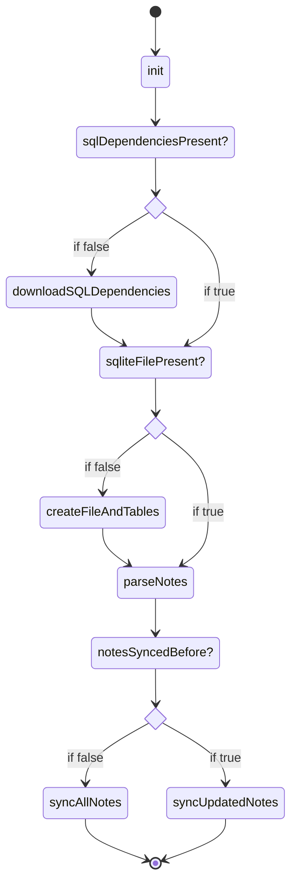

## Quickstart
- to enable sqlite, see [[dendron://dendron.dendron-site/dendron.topic.workspace.sqlite]]
- > NOTE: this **only** works for enginev2 today and not enginev3

## Architecture

### Store initialization Diagram
> NOTE: this is implemented for `enginev2`. it has not yet been implemented for `enginev3`

### Code Flow
- How enginev2 initializes with SQLite: [[dendron://dendron.docs/pkg.dendron-engine.lifecycle.init]]

### Relevant Files
- SQLiteMetadataStore: [[../packages/engine-server/src/drivers/SQLiteMetadataStore.ts]] - this provides metada via SQLite ^sx51483htt71
- Prisma Schema: [[../packages/engine-server/prisma/schema.prisma]] - what is currently indexed at startup 

## Dependencies
- [[node-sqlite3|scratch.2022.10.12.112545.node-sqlite3]]

## Details

### Download Binaries
If prisma binaries aren't in place and `sqlite` is enabled, Dendron will download them to `~/.dendron/`. Some implementation details to consider:
- download happens in the constructore of the `SQLiteMetadataStore` (this is not ideal especially if it gets instaitated multiple times - we do this because the `IDataStore` interface doesn't have an `init` method): https://github.com/dendronhq/dendron/blob/master/packages/engine-server/src/drivers/SQLiteMetadataStore.ts#L56:L56
    - in case there is a network issue with the download, we have a [circuit breaker](https://github.com/dendronhq/dendron/blob/master/packages/engine-server/src/drivers/file/storev2.ts#L527:L527) that will kill the download
    - the actual binaries are uploaded to an S3 bucket that is fronted by cloudfront (s3 download speed too slow otherwise, 20MB = 10min)

- > NOTE: in order for this to work with webpack, we also implement various shims which are detailed in this [pull request](https://github.com/dendronhq/dendron/pull/3489) ^7ffjqoa2grrv

## Cookbook

### Check if SQLite is enabled
- you can verify that sqlite is enabled by checking for some of the following cues:
    - `metadata.db` exists in your workspace root
    - checking for the following in `dendron.server.log`: `checking if sql is initialized...`
        - this will only print if `sqlite` is enabled
        - > NOTE: this won't be available when developing because we don't output the `dendron.server.log` file in the dev environment

## Related
- public docs: [[dendron://dendron.dendron-site/dendron.topic.workspace.sqlite]]

- init logic: 
    - v3: [[dendron://dendron.docs/pkg.dendron-engine.lifecycle.init.v3]]

- prisma logic: [[dendron://dendron.docs/pkg.dendron-engine.ref.prisma]]
- data model: [[dendron://dendron.docs/leaflet.journal.2022.05.18.data-model-2-0]]
- query: [[dendron://private/leaflet.journal.2022.10.12.engine-query-architecture]]
- browser store: [[dendron://private/proj.2022.06-store-refactor.design.browser-node-env]]
- engine v3 arch: [[dendron://private/user.jonathan.research.engine-v3-architecture]]

- tasks
    - initial sqlite implementation: [[dendron://private/task.2022.07.30.sqlite-backend]]