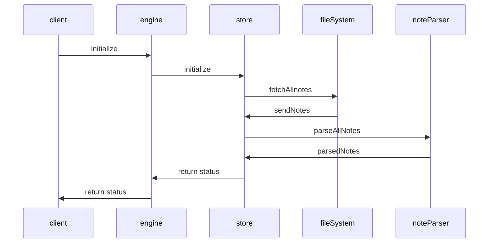

## Initialization



- [Video walkthrough](https://youtu.be/nWJCP1DR5Io)
- Entry Point: [[../packages/engine-server/src/enginev2.ts]]

See [[Engine|dendron://dendron.docs/pkg.dendron-engine.ref.engine]] for additional details

### Pseudocode

#### Query - Engine

- loc: engine-server/engine.ts
- desc: engine will query the store

```ts
async query(scope: Scope, queryString: string, opts?: QueryOpts) {
    ...
  if (queryString = '**/*') {
    data = store.query(scope, '**/*', opts);
    refreshNodes(data.data);
  }
}
```

#### Query - Store

- loc: engine-server/store.ts
  - FileStore.query
- desc: gets all notes from the underlying store
  - store is swappable. currently, we only support `FileStore`

```ts
if (isQueryAll(queryString)) {
    noteProps = getNoteAll() {
        allFiles = getAllFiles({
            ...
            include: ["*.md"]
        })
        return files2Notes(allfiles) {
            fp = new FileParser({ errorOnEmpty: false })
            data = fp.parse(allFiles);
            return data.map(n => n.toRawProps());
        }
    }
    data = new NodeBuilder().buildNoteFromProps(noteProps);
}
```

#### Parse Files

- loc: engine-server/parser.ts
- details: read files

```ts
parse(data: string[]): Note[] {
    fileMetaDict: FileMetaDict = getFileMeta(data) {
      metaDict: FileMetaDict = {};

      forEach(fpaths, fpath => {
        { name } = path.parse(fpath);
        lvl = name.split(".").length;

        if (!_.has(metaDict, lvl)) {
          metaDict[lvl] = [];
        }
        metaDict[lvl].push({ prefix: name, fpath });
      });
      return metaDict;
    }

    ...
    root = fileMetaDict[1].find(n => n.fpath === "root.md") as FileMeta;
    const { node: rootNode } = this.toNode(root, [], store, {
      isRoot: true,
      errorOnBadParse: this.opts.errorOnBadParse
    }) as { node: Note };

    ...
    while (_.has(fileMetaDict, lvl)) {
        ...
        const { node, missing } = this.toNode(ent, prevNodes, store, {})
    }
}

toNode {
    noteProps = mdFile2NodeProps(path.join(store.opts.root, ent.fpath)) {
        const { data, content: body } = (matter.read(fpath, {}) as unknown) as {
        const { name: fname } = path.parse(fpath);
        const dataProps = DNodeRaw.createProps({ ...data, fname, body });
    }
    // missing
    if (!parent && !opts.isRoot) {
      missing = parentPath;
      if (opts.errorOnEmpty) {
        throw new Error(JSON.stringify(errorMsg));
      }
    }
    const note = new Note({ ...noteProps, parent, children: [] });
}
```
