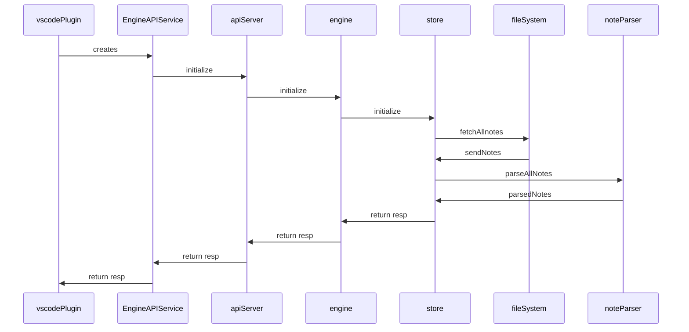

## Initialization



- EngineAPIService: created in [[../packages/plugin-core/src/_extension.ts#^9dr6chh7ah9v]]

  - implements DEngineClient interface for engine -> [[../packages/common-all/src/types/typesv2.ts#^sdxp5tjokad9]]
  - in production, we launch `apiServer` in a separate process, but if not, we run everything in same process. see [[../packages/plugin-core/src/_extension.ts#^pyiildtq4tdx]]

- [Video walkthrough](https://youtu.be/nWJCP1DR5Io)
- Entry Point: [[../packages/engine-server/src/enginev2.ts]]

See [[Engine|dendron://dendron.docs/pkg.dendron-engine.t.engine.arch]] for additional details

### Pseudocode

#### Query - Engine

- loc: engine-server/engine.ts
- desc: engine will query the store

```ts
async query(scope: Scope, queryString: string, opts?: QueryOpts) {
    ...
  if (queryString = '**/*') {
    data = store.query(scope, '**/*', opts);
    refreshNodes(data.data);
  }
}
```

#### Query - Store

- loc: engine-server/store.ts
  - FileStore.query
- desc: gets all notes from the underlying store
  - store is swappable. currently, we only support `FileStore`

```ts
if (isQueryAll(queryString)) {
    noteProps = getNoteAll() {
        allFiles = getAllFiles({
            ...
            include: ["*.md"]
        })
        return files2Notes(allfiles) {
            fp = new FileParser({ errorOnEmpty: false })
            data = fp.parseFiles(allFiles);
            return data.map(n => n.toRawProps());
        }
    }
    data = new NodeBuilder().buildNoteFromProps(noteProps);
}
```
