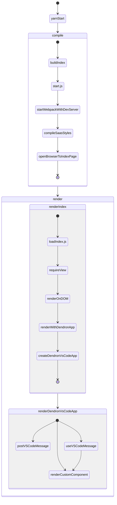

## IDE Mode 

![[Ide Mode|dendron://dendron.docs/pkg.dendron-plugin-views.arch.lifecycle.ide-mode]]

## Browser Mode - Startup

The following diagram summarizes the startup of Dendron in [[Browser Mode|dendron://dendron.docs/pkg.dendron-plugin-views.concepts#browser-mode]]. It's divided into three phases:
- compile: starting webpack dev server, creating the index.html page based on `REACT_APP_VIEW_NAME`
- renderIndex: dynamically loading `REACT_APP_VIEW_NAME` component
- renderDendronVsCodeApp: rendering of `REACT_APP_VIEW_NAME` component



The following discusses each phase in more detail with pseudocode

### compile
1. User runs `yarn:start`
   This runs the following tasks:
   ```json
   "yarn build:index && node scripts/start.js"
   ```
   - NOTE: `build:index` generates the `index.html` file that is used to load the plugin. More details in [[Build Index|dendron://dendron.docs/pkg.dendron-plugin-views.ref.build-index]]
1. Webpack loads
    - [[../packages/dendron-plugin-views/scripts/start.js]]
    ```ts
    config = configFactory
    createCompiler(config)
    createDevServerConfig

    prepareProxy

    openBrowser
    ```
    - config: [[../packages/dendron-plugin-views/config/webpack.config.js]]
    ```ts
    mode: isEnvProduction ? "production" : "development"
    entry: { 
        
    }
    
    ```

## Render
![[Render|dendron://dendron.docs/pkg.dendron-plugin-views.arch.lifecycle.render]]

## Change Active Editor

When the active editor changes, the `useVSCodeMessage` hook in [[DendronVSCodeApp|dendron://dendron.docs/pkg.dendron-plugin-views.arch.lifecycle#^MXu9QPtvmOvr]] will update the state with note(s) that have changed

```tsx
useVSCodeMessage(msg) {
    ctx = "useVSCodeMsg"
    switch(msg) {
        case ON_DID_CHANGE_ACTIVE_TEXT_EDITOR {
            note, sync := msg
            log "onDidChangeActiveTextEditor"

            // update all notes
            if sync {
                log "syncEngine:pre"
                dispatch(initNotes)
            }
            // update one note
            if (syncChangedNote && note)
                log "syncNote:pre"
                ideDispatch(engineSlice.syncNote)
            ...
            dispatch(setNoteActive(note))

        }
    }

}
```

## Common

Some utilities that are commonly used 

### useEngine

- loc: common-frontend/src/features/engine/hooks.ts
- desc: initialize engine if its not initialized

```tsx
useEngine(engineState) {
    useEffect {
        if !hasInitialized(engineState)
            // see [[initNotes|dendron://dendron.docs/pkg.dendron-plugin-views.arch.lifecycle#initnotes]]
            dispatch(initNotes)
    }
}

```

### initNotes

- loc: common-frontend/src/features/engine/slice.ts
- desc: initialize notes for redux engine

```ts
// sideEffect, when initNotes is dispatched, state is set to Pending
effect(state, requestId) {
    when initNotes.pending {
        if (state.loading = "idle") {
            state.loading = LoadingStatus.PENDING;
            state.currentRequestId = meta.requestId;
        }
    }
}

initNotes {
    api = DendronApiV2.new
    resp = api.workspaceSync
    setFromInit(resp) {
        // set all variables
        state.notes = notes;
        state.wsRoot = wsRoot;
        state.schemas = schemas;
        state.vaults = vaults;
        state.config = config;
    }
}

// side effect, after notes are set, state is set back to idle
effect(state, requestId) {
    when initNotes.fulfilled {
        if (state = "idle" && state.currentRequestId === requestId) {
            state.loading = "idle"
            delete state.currentRequestId
        }

    }

}
```
