## Workspace

### Modifying contributes in package.json

The `contributes` in `package.json` is all generated. If you are planning on modifying it - don't add it directly in the json file but use `yarn gen:config` to do it instead

### Add new Workspace State

Use the [[State Service|pkg.plugin-core.arch.state]] when working with VSCode workspace related state.

### Add a new Config

See [[Add New Config|dendron://dendron.docs/pkg.common-all.dev.cook#add-new-config]]

### Only show view or command while Developing

Register the view or command with `when: DendronContext.DEV_MODE`

## Commands

### Triggering commands in webview

A number of our commands use simple webviews that are rendering Markdown content to show a preview of an operation. See [[fixKeybindingConflicts|dendron://dendron.dendron-site/dendron.topic.doctor#fixkeybindingconflicts]] for example.

Sometimes we want to simulate a button click within the rendered markdown, and an easy way to do this is to utilze [command URIs](https://code.visualstudio.com/api/extension-guides/command#command-uris).

This lets you link to arbitrary commands (built-in and extension-contributed) using a standard Markdown link.

You can see an example usage in `KeybindingUtils.showKeybindingConflictPreview`, which uses command URIs to trigger `workbench.action.openGlobalKeybindingsFile`, `workbench.action.openDefaultKeybindingsFile`, and `dendron.copyToClipboard` commands.

If you need to add a new command only to use it as described here, also make sure you [[set proper enablement of them|dendron://dendron.docs/pkg.plugin-core.dev.cook#^fk7pnjllh594]]

### Adding internal commands

There are cases where we need to add commands that VSCode recognizes, but not expose them to any of the VSCode's user facing UIs. Some good examples are [[Copy To Clipboard|../packages/plugin-core/src/commands/CopyToClipboardCommand.ts]], [[Convert Candidate Link|../packages/plugin-core/src/commands/ConvertCandidateLink.ts]], and [[Note Lookup Autocomplete|../packages/plugin-core/src/commands/NoteLookupAutoCompleteCommand.ts]]

When adding these kinds of commands, make sure to set the proper enablement clause for them so that they do not show up in the command palette or in the contextual menu. ^fk7pnjllh594

To illustrate, `CopyToClipboardCommand` is only used for simulating a button click within a rendered markdown preview, and the `when` clause is set to `false`.

Note that setting `when` clauses do not stop you from executing this command through `vscode.commands.executeCommand` or through a command URI. It just hides them from user facing UIs.

### Add a new Command

This goes over adding a new command with lookup. To see an example, see this [command](https://github.com/dendronhq/dendron/blob/master/packages/plugin-core/src/commands/InsertNoteLink.ts) and this commit: `cc8a02b4`.

```mermaid
sequenceDiagram
    participant user
    participant lookupCommand
    participant lookupController
    participant lookupProvider
    user ->> lookupCommand: user issues command
    Note left of user: 1. cmd.gatherInput()
    rect rgb(0, 50, 0)
      lookupCommand ->> lookupController: creates controller
      lookupCommand ->> lookupProvider: creates provider
      lookupCommand ->> lookupController: call show(provider)
      lookupCommand ->> lookupProvider: subscribe to provider
      lookupController ->> user: shows quickinput
    end
    user ->> user: chooses a selection
    lookupProvider ->> lookupCommand: notify(selection)
    lookupCommand ->> lookupCommand: calls command.execute()
```



1. Add command to `DENDRON_COMMANDS` under `plugin-core/src/constants.ts`
2. Open the command prompt, enter `Run Task`, and run `gen:config`
   - this will add the command to `package.json`
3. Create the new command in `plugin-core/src/commands/{COMMAND_NAME}.ts`
   - you can copy the contents of an existing command (eg. `src/commands/ShowHelp.ts`) to help you get started
4. Write tests
   - tests are in `plugin-core/src/test/suite-integ/{COMMAND}`
   - testing instructions are [[here|dev.process.qa]]
5. Write command logic
6. If it makes sense, add a keyboard shortcut for the command. Make sure it doesn't conflict with an generic VSCode command or existing Dendron commands. You can detect existing keybindings by using the guide [here](https://code.visualstudio.com/docs/getstarted/keybindings#_detecting-keybinding-conflicts)
7. Add command to `src/commands/index.ts`
8. If your command requires an active workspace to function, make sure that `requireActiveWorkspace = true`
   - eg: see [[../packages/plugin-core/src/commands/CreateDailyJournal.ts]]
   ```ts
   export class CreateDailyJournalCommand extends CreateNoteWithTraitCommand {
    // THIS needs to be set to tell Dendron to NOT activate this command unless dendron is active
    static requireActiveWorkspace: boolean = true;
    ...
   }
   ```
9. If your command needs to manually clean up resources, make sure that any places where your command is constructed that it gets properly cleaned up when out of scope.  An example of this is with the `NoteLookupCommand`. The preferred way to do this is by implementing the vscode `Disposable` interface (although `NoteLookupCommand` doesn't do this yet).
10. Submit pull request

Conventions:

- if your command involves opening a note, also return it in the `CommandOutput` signature. this makes it easy to compose the command as well as test it

#### Gotchas

If the command needs to accept input objects from VSCode, for example [[ShowPreview|../packages/plugin-core/src/commands/ShowPreview.ts]], then base your command on [[InputArgCommand|../packages/plugin-core/src/commands/base.ts#L168]] and avoid adding `gatherInputs` and `enrichInputs`. Otherwise Dendron can convert the input object into a plain javascript object.

### Executing a command programatically

```ts
cmd = new {ExistingDendronCommand}()
// logic to get args
const args = ....
cmd.execute(args)
```

### Add a command in dev/preview

This section goes over adding a command in dev/preview. For an example, see this [command](https://github.com/dendronhq/dendron/pull/2190). It adds Export Pod V2 commands in dev.

1. Add a new config option to dev namespace in `DendronDevConfig` under `packages/common-all/src/types/workspace.ts`, `packages/common-all/src/types/configs/dev/dev.ts` and `packages/common-all/src/constants/configs/dev.ts`.
1. Add your own context to `DendronContext` in `packages/plugin-core/src/constants.ts` for enablement of the command. Set the Context with the config created in the first step in `packages/plugin-core/src/_extension.ts` In the example PR, see:

```ts
VSCodeUtils.setContext(
  DendronContext.ENABLE_EXPORT_PODV2,
  dendronConfig.dev?.enableExportPodV2 ?? false
);
```

1. In `DENDRON_COMMANDS` under `plugin-core/src/constants.ts`, update the when/enablement clause of the desired command with the context created in above step.
1. Open the command prompt, enter `Run Task`, and run `gen:config`
   - this will update the command in `package.json`
1. Manually test with test-workspace, the command should only be visible in command palette if config option is set to true.

### Adding a new doctor command

When adding a doctor command, do the following if the workspace needs to be reloaded:
- add action to `RELOAD_BEFORE_ACTIONS` if workspace needs to be reloaded before running the action
- add action to `RELOAD_AFTER_ACTIONS` if workspace needs to be reloaded after the action has run

See [this pr](https://github.com/dendronhq/dendron/pull/2620/files) for an example

## Lookup

- ![[dendron://dendron.docs/pkg.plugin-core.t.lookup.cook]]

## Views

### Using the Dendron Preview on arbitrary markdown

You can use the Dendron Preview to show custom markdown. To do so:

1. Use the `openNoteInPreview` from [[../packages/plugin-core/src/commands/ShowPreview.ts#L327]]
1. See [[Create a pseudo-note for a non-note file|dendron://dendron.docs/pkg.plugin-core.dev.cook#create-a-pseudo-note-for-a-non-note-file]]

### Adding a Web UI Component

1. see [[Create a new Command|pro.dendron-plugin.cook#create-a-new-command]] for creating a new command
2. Add a new entry to [DendronWebViewKey](https://github.com/dendronhq/dendron/blob/master/packages/common-all/src/types/typesv2.ts)
3. in `execute`, create a new webview
   ```ts
     const title = //TODO: add panel title
     const panel = window.createWebviewPanel(
       "dendronIframe", // Identifies the type of the webview. Used internally
       title, // Title of the panel displayed to the user
       ViewColumn.One, // Editor column to show the new webview panel in.
       {
         enableScripts: true,
         enableCommandUris: true,
         enableFindWidget: true,
         localResourceRoots: [],
       }
     );
     resp = WebViewUtils.genHTMLForWebView({
         title: "Dendron Config",
         view: DendronWebViewKey[TODO]
     });
     panel.webview.html = resp;
   ```

Related:

- See [[here|pkg.dendron-next-server.dev#development]] for how to preview and test your web ui.

### Listening for copy event in webview

- See [Webview: Copy to clipboard within internal IFRAME does not work on macOS · Issue #135017 · microsoft/vscode](https://github.com/microsoft/vscode/issues/135017)

### Getting a view

- See all web view keys [here](https://github.com/dendronhq/dendron/blob/bea9b6501e7699afdecda2ee14ad37fb4415ab32/packages/common-all/src/types/typesv2.ts#L711)

```ts
const panel = getExtension().getWebView(DendronWebViewKey.{KEY});
```

### Executing logic when the current editor changes

See [[Workspace Watcher|dendron://dendron.docs/pkg.plugin-core.ref.workspace-watcher]]

## Other

### Access Clipboard

```ts
import { clipboard } from "../utils";
clipboard.writeText(link);
```

### Check if file is in vault

- see src/views/DendronTreeViewV2.ts

```ts
const uri = editor.document.uri;
const basename = path.basename(uri.fsPath);
const ws = getWS();
if (!ws.workspaceService?.isPathInWorkspace(uri.fsPath)) {
  return;
}
```

### Insert Text

- src/commands/InsertNoteCommand.ts

```ts
const editor = VSCodeUtils.getActiveTextEditor()!;
const pos = editor.selection.active;
await editor.edit((builder) => {
  const selection = new Selection(pos, pos);
  builder.replace(selection, txt);
});
```

### Prompt User for Input using Selection

- see [this](https://github.com/dendronhq/dendron/blob/master/packages/plugin-core/src/commands/VaultAddCommand.ts)

### Prompt User for Input using Free Text

- see [this](https://github.com/dendronhq/dendron/blob/master/packages/plugin-core/src/commands/VaultAddCommand.ts)

```ts
let out = await VSCodeUtils.showInputBox({
  prompt: "Path to your new vault (relative to your workspace root)",
  placeHolder: localVaultPathPlaceholder,
});
if (PickerUtilsV2.isStringInputEmpty(out)) return;
```

### Get the line offset of the frontmatter

- A lot of the times you need to offset the line count of the file content of a markdown file so that it takes into account of the prepended frontmatter.
- You can use the utility method `RemarkUtils.getNodePositionPastFrontmatter` to get the position where the first non-frontmatter text starts.
- The return value of this can be converted to VSCode positions with `VSCodeUtils.point2VSCodePosition`

### Use DevTrigger Command for development

[DevTriggerCommand](https://github.com/dendronhq/dendron/blob/master/packages/plugin-core/src/commands/DevTriggerCommand.ts) is available to be invoked from Command Palette while in Development Mode.

You can use this command for development purposes when need to trigger some arbitrary piece of code by placing it into `execute()` function and invoking the `Dendron:Dev: Dev Trigger`.

Just make sure to remove your code from the `execute()` prior to putting up your pull request (unless your pull request is marked as draft to invoke some piece of code you put up in DevTrigger to get feedback on).

### Create a pseudo-note for a non-note file

In some cases, like when previewing a non-note markdown file, we sometimes need
to reference a file that's not a note. Since a lot of Dendron APIs need note
objects, you can create a pseudo-note for these files.

Create one using
[[DNode.createForFile|../packages/common-all/src/dnode.ts#L1287]]. This will
create a fake note object and a fake vault object. Created objects are not added
to the engine automatically, temporarily add and then remove them if needed.

You can check if a note is a pseudo-note using [[DNode.isFileId|../packages/common-all/src/dnode.ts]] on a note's id.

### Workspace Trust

Any feature that causes dynamic code execution (code supplied or modifiable that is outside of the published Dendron extension) **must first check whether the user has enabled [workspace trust](https://code.visualstudio.com/docs/editor/workspace-trust)**. Some examples of this are [[Hooks|dendron://dendron.dendron-site/dendron.topic.hooks]] and [[Traits|dendron://dendron.dendron-site/dendron.topic.traits]].

To check whether workspace trust has been enabled, you can use VSCode's API: `vscode.workspace.isTrusted`. If working in the context of EngineAPIService, there is also a private member that contains the trust information (currently `_trustedWorkspace`).

If your scenario is blocked because the user hasn't enabled workspace trust, please add an notification prompt to the user explaining that the scenario didn't run because the workspace is not trusted.
