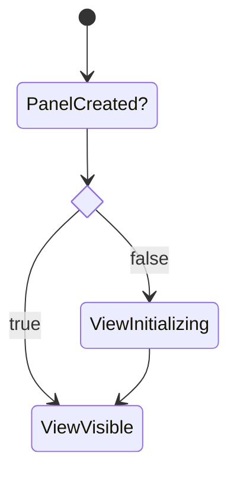

## Summary

Describes how views work in the plugin

## Details

Dendron has two kinds of views, editor views and tree views.

These views can be implemented using either a web view implementation or a native view implementation.

## Concepts

### Editor View

A view that occupies an editor pane in vscode

### Tree View

A view that occupies a side pane in VSCode. More details [here](https://code.visualstudio.com/api/extension-guides/tree-view)

### Web View Implementation

A web vies is built using HTML and javascript. A web view can be created for an editor view or a tree view.

More details in [[Editor|dendron://dendron.docs/pkg.plugin-core.ref.web-view.editor]]

### Native View Implementation

A native view is a view that is native to the VSCode.

## Lifecycle

### Revealing a webview
A panel is a webview in the below diagram

## Lookup

- [[Editor View - Web View Implementation|dendron://dendron.docs/pkg.plugin-core.ref.web-view.editor]]
