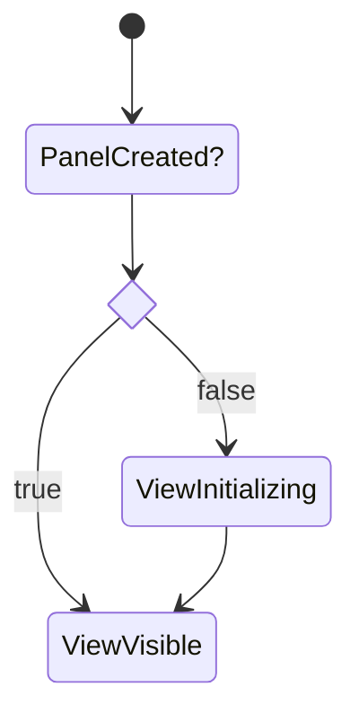

## Summary

This describes the [[Web View Implementation|dendron://dendron.docs/pkg.plugin-core.ref.views#web-view-implementation]] of an [[Editor View|dendron://dendron.docs/pkg.plugin-core.ref.views#editor-view]].

## Lifecycle



### Initialize a Vikew

```ts
// key of the view
VIEW_KEY :=
const { bundleName: name } = getWebEditorViewEntry(DendronEditorViewKey[KEY]);
const webViewAssets = WebViewUtils.getJsAndCss(name);
```

### Build HTML Content

### Copying

Dendron does some extra logic when a copy event is detected in a webview to strip out theming related CSS (otherwise, users copying from a dark theme would also paste the dark background when pasting).

Logic

```ts
addEventListener(copy, e => {
    htmlSelection = getHTMLOfSelection
    copyToClipboard htmlSelection
})

copyToClipboard {
    // strip styling and create blob
    blob :=

    item = new ClipboardItem(blob)
    clipboard.write(item)

```

For full details, see the [[PR|dendron://dendron.docs/pkg.plugin-core.ref.web-view.editor#^wOEBfg2aXhwp]].

## Implementations

- [[Note Preview|dendron://dendron.docs/pkg.dendron-plugin-views.ref.note-preview]]

## Reference

<!-- Anything else that is useful to lookup -->

## Cook

<!-- How to do common operations with this code -->

## Lookup

- [[Plugin View Lifecycle|dendron://dendron.docs/pkg.dendron-plugin-views.arch.lifecycle]]

## Past Tasks

- [enhance: strip out theming on copy and paste from preview by nickolay-kondratyev · Pull Request #1807 · dendronhq/dendron](https://github.com/dendronhq/dendron/pull/1807) ^wOEBfg2aXhwp
