## Summary

VSCode command execution

## Lifecycle

### Initialization

This is a simplified sequence diagram of a command lifecycle.

```mermaid
sequenceDiagram
    participant user
    participant lookupCommand
    participant lookupController
    participant lookupProvider
    user ->> lookupCommand: user issues command
    Note left of user: 1. cmd.gatherInput()
    rect rgb(0, 50, 0)
      lookupCommand ->> lookupController: creates controller
      lookupCommand ->> lookupProvider: creates provider
      lookupCommand ->> lookupController: call show(provider)
      lookupCommand ->> lookupProvider: subscribe to provider
      lookupController ->> user: shows quickinput
    end
    user ->> user: chooses a selection
    lookupProvider ->> lookupCommand: notify(selection)
    lookupCommand ->> lookupCommand: calls command.execute()
```

### Exceptions

Any uncaught exceptions in a child command will be caught and logged by `BaseCommand`
