## Summary

Lookup command lifecycle

## Lifecycle

### Initialization

This is a simplified sequence diagram of a lookup command

Participants:
- lookupCommand: command being called
- lookupController: This is an instance of [[LookupController|../packages/plugin-core/src/components/lookup/LookupControllerV3.ts]]
- lookupProvider: This is an instance of [[LookupProvider|../packages/plugin-core/src/components/lookup/LookupProviderV3.ts]]
- historyService: This is a service that listens to events in the background that other commands can listen to events from

```mermaid
sequenceDiagram
    participant user
    participant lookupCommand
    participant lookupController
    participant lookupProvider
    participant historyService
    user ->> lookupCommand: user issues command
    Note left of user: 1. cmd.gatherInput()
    rect rgb(0, 50, 0)
      lookupCommand ->> lookupController: creates controller
      lookupCommand ->> lookupProvider: creates provider

      note right of lookupProvider: listens to `lookupProvider` events
      lookupCommand ->> historyService: subscribe("lookupProvider")

      note right of lookupCommand: command passes provider to controller
      lookupCommand ->> lookupController: call controller.show(provider)
      lookupController ->> user: shows quickinput
    end
    user ->> lookupController: chooses a selection

    lookupProvider ->> historyService: notifies `historyService` that a selection has been made 
    historyService ->> lookupCommand: notify("lookupProvider", data)
    lookupCommand ->> lookupCommand: calls command.execute()
```

