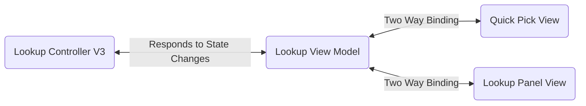

## Summary

Lookup command lifecycle

## Lifecycle

### Initialization

1. Lookup factory created as part of dendron extension on startup

- [[../packages/plugin-core/src/workspace.ts]]
```ts
class DendronExtension { 
  constructor { 
    ...
    @lookupControllerFactory = new LookupControllerV3Factory
  }
}
```

- [[../packages/plugin-core/src/components/lookup/LookupControllerV3Factory.ts]]
- class: LookupControllerV3Factory
```ts
create { 
  ...
  return new LookupControllerV3
}
```

See the [[Sequence Diagram|dendron://dendron.docs/pkg.plugin-core.t.lookup.arch.seq-diagram]].

<!-- This is a simplified sequence diagram of a lookup command -->

<!-- Participants:
- lookupCommand: command being called
- lookupController: This is an instance of [[LookupController|../packages/plugin-core/src/components/lookup/LookupControllerV3.ts]]
- lookupProvider: This is an instance of [[LookupProvider|../packages/plugin-core/src/components/lookup/LookupProviderV3.ts]]
- historyService: This is a service that listens to events in the background that other commands can listen to events from

![[dendron://dendron.docs/pkg.plugin-core.t.lookup.arch.seq-diagram]] -->


## Components

The Lookup Control uses a pseudo [MVVM](https://en.wikipedia.org/wiki/Model%E2%80%93view%E2%80%93viewmodel) pattern. 

1. `LookupControllerV3.ts` is the 'model' / controller. 
1. A view model in `LookupViewModel.ts` represents the data state for the lookup options.
1. 2 views subscribe to the view model
    1. A QuickPickView, which represents the UI state of the buttons in the quick pick.
    1. A LookupPanelView, which represents the view for the LookupPanel webview on the side.

So essentially:

_Note: The arrows in the diagram are supposed to be bi-directional_

The views in this case are not true views as typically found in MVVM - rather, they are proxies for the views - For the QuickPickView, it can be thought of as a proxy to the vscode `QuickPick` control component, whereas for the LookupPanelView, it can be thought of as a proxy to the React based webview component.

## Related
- [[History Service|dendron://dendron.docs/pkg.dendron-engine.arch.history-service]]